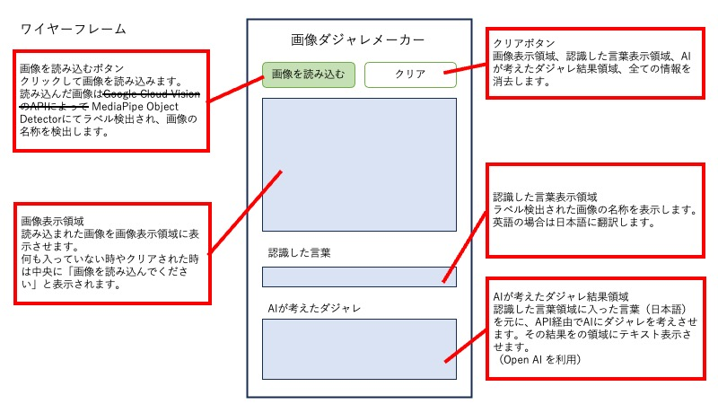
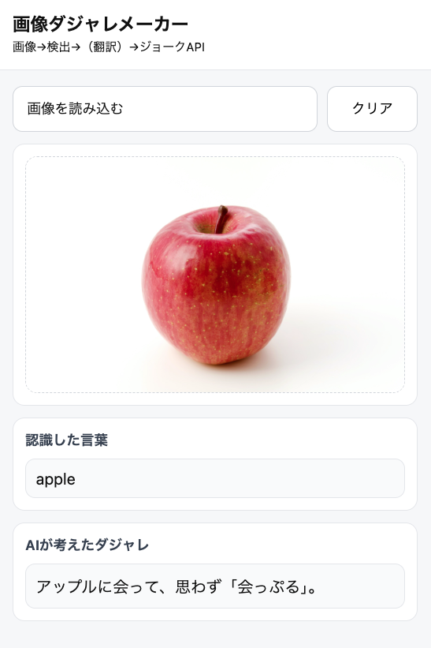

# ①課題名
画像ダジャレメーカー

## ②課題内容（どんな作品か）
画像から単語を自動抽出し、ダジャレを生成する

## ③アプリのデプロイURL
https://ken-fuji-git.github.io/kadai_API_v1/public/index.html

## 工夫した点・こだわった点
当初は Google Cloud Vision のAPIによって画像認識→ラベル取得を行う計画だったものの挫折。
サーバーを使わないという MediaPipe Object Detector を使う方法もあると知り、そちらを採用したが、結局大変だった。
OpenAI の API設定もわからない事だらけで混乱した。

## ざっくりフロー
1) 画像を選択（input type=file）
2) MediaPipe Object Detector
    - ブラウザ内で推論（サーバ不要）
    - ラベル（例: "cat"）を得る
3) 同一オリジンで /api を叩く
4) Firebase Hosting の rewrites が発動
    "/api" → Functions (asia-northeast1) に転送
5) OpenAI Responses API へ
    入力: 「単語 cat で日本語ダジャレを1つ」
6) Functions が JSON にして返却

##　　ワイヤーフレーム

##　 スクリーンショット

## 難しかった点・次回トライしたいこと（又は機能）
とにかく全ての段階が難しかった。
Firebase Hosting の設定でターミナルを使う事自体を知らず、恐る恐る進めた。
動きはしたものの、とんでもない設定をしているんじゃないかという不安がずっと続いている。

## フリー項目（感想、シェアしたいこと等なんでも）
がんばった割には、AIの返す答えがいまいちでガクッとしましたが、まずは動いた事に感動です。引き続き頑張ります！